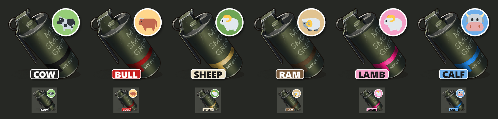

# Livestock Airdrops

An Oxide/uMod plugin for **Rust** that turns custom supply signals into livestock deliveries. A player throws a livestock signal, a cargo plane flies over, and a live **cow, bull, sheep, ram, lamb or calf** floats down under a bunch of party balloons, ready to be led home.



## Features

- **Six livestock signals:** Prize Cow, Enraged Bull, Domestic Sheep, Proud Ram, Baby Lamb and Baby Calf. Each has its own name and its own inventory icon, published as Steam Workshop items.
- **A real airdrop:** the vanilla cargo plane flies over the signal at a configurable height and speed. Instead of a crate it drops the animal.
- **Balloon descent:** the animal comes down under a bunch of party balloons, with a speech bubble saying MOO or BAA. Shoot balloons off and it falls faster. When it lands, the balloons drift away into the sky.
- **Safe landings:** AI stays paused during the fall, so bulls don't charge at the sky. On landing the animal is placed on the navmesh, and environmental damage is blocked for a few seconds.
- **The thrower owns the animal:** it trusts the thrower straight away, like a vendor purchase, so the thrower can lead it.
- **Babies are random:** lambs and calves come out male or female 50/50. Calves use separate male and female prefabs.
- **The smoke stops after delivery:** the signal's smoke ends a configurable time after the last animal lands. Vanilla keeps it going for 210 s.
- **Works with other plugins:** see [Compatibility](#compatibility) for SignalCooldown and BotReSpawn.

## Requirements

- A Rust server running **Oxide/uMod**.
- A Rust version with the **Gen2 livestock** (`assets/rust.ai/agents/cow`, `sheep`, `calf`, …). On load the plugin warns about any prefab path that doesn't exist on the server.

## Installation

1. Copy `LivestockAirdrops.cs` into `oxide/plugins/`.
2. The plugin creates `oxide/config/LivestockAirdrops.json` with working defaults, including the Workshop icon IDs.
3. Give staff the permission: `oxide.grant group admin livestockairdrops.admin`

## Commands

| Command | Where | Description |
|---|---|---|
| `giveanimal <player or SteamID> <animal name>` | Server console / RCON | Gives a livestock signal. Animal names may contain spaces (`Baby Calf`) and partial names work. With no arguments it lists the animals. |
| `/giveanimal <player> <animal name>` | Chat | Same, for players with `livestockairdrops.admin`. |
| `livestockairdrops.prefabs <words…>` | Server console | Lists the server's prefab paths that contain all the words given, e.g. `livestockairdrops.prefabs rust.ai sheep`. |

## Configuration

`oxide/config/LivestockAirdrops.json`:

### General Settings

| Setting | Default | Description |
|---|---|---|
| Drop Altitude (Meters) | `150` | Plane height above the ground at the drop point. |
| Plane Flight Speed | `40` | Cargo plane speed. |
| Descent Speed Modifier | `1.0` | Multiplies the 6 m/s descent speed. |
| Prevent Damage To Animal On Landing | `true` | Blocks non-player damage while falling and for 5 s after landing. |
| Use Party Balloons | `true` | Carry the animal under balloons. |
| Balloon Prefabs (random mix, empty = auto-detect) | latex, circle, heart, star | Each balloon is picked at random from this list. |
| Speech Bubble Prefab (shows Balloon Text) | speech bubble | Floats on top and shows the animal's `Balloon Text`. Leave blank to put the text on every balloon instead. |
| Balloon Count | `8` | Number of balloons (max 16). |
| Balloon Scale / Speech Bubble Scale | `2.0` / `3.0` | Balloon sizes. |
| Balloon Height Above Animal | `1.3` | Height of the point where the strings are tied. |
| Popped Balloons Speed Up Descent | `true` | Each balloon shot off makes the animal fall faster, up to 4×. |
| Thrower Can Lead Animal Immediately | `true` | The animal trusts the thrower on landing. |
| Stop Signal Smoke After Landing (Seconds, -1 = vanilla) | `10` | When the signal smoke ends, counted from the last landing. |

### Airdrop Configurations (one entry per signal)

| Setting | Description |
|---|---|
| Animal Name | Item name, and the name used by `giveanimal`. |
| Signal Skin ID | How the plugin recognises the signal, and the source of its icon. Must be unique per animal. |
| Prefab Path | The animal to spawn (the female prefab, for species with separate prefabs). |
| Sex (Random, Male, Female) | For sheep and lamb (one prefab for both sexes) and for species with a male prefab. |
| Male Prefab Path (optional) | For species with separate male prefabs, e.g. `calfmale.prefab`. |
| Spawn Count | Animals per signal (max 10). |
| Notification Message | Chat message to the thrower. `{name}` and `{count}` are replaced. |
| Balloon Text | Text on the speech bubble. |

Run `oxide.reload LivestockAirdrops` after editing.

## Signal icons

`supply.signal` has no store skins and the Rust skin editor can't target it. The icons are icon-only Workshop items (`"ItemType": "CustomItem"`) that replace the inventory and hotbar icon:

| Signal | Workshop ID |
|---|---|
| Prize Cow | [3813316121](https://steamcommunity.com/sharedfiles/filedetails/?id=3813316121) |
| Enraged Bull | [3813325374](https://steamcommunity.com/sharedfiles/filedetails/?id=3813325374) |
| Domestic Sheep | [3813326419](https://steamcommunity.com/sharedfiles/filedetails/?id=3813326419) |
| Proud Ram | [3813327235](https://steamcommunity.com/sharedfiles/filedetails/?id=3813327235) |
| Baby Lamb | [3813328103](https://steamcommunity.com/sharedfiles/filedetails/?id=3813328103) |
| Baby Calf | [3813328745](https://steamcommunity.com/sharedfiles/filedetails/?id=3813328745) |

The first time a player sees an icon, their game downloads it from the Workshop, so it may briefly show the default icon.

`icons/make_icons.py` generates the icons. It uses Pillow, the game's own supply signal icon as the base and Twemoji for the animals. To make your own, run it and publish each folder as a Workshop item with an `icon.png` and a `manifest.txt` (`"ItemType": "CustomItem"`). Then put the new IDs in the config.

## Selling signals in a shop

Any shop that can run a console command when something is bought works. The command is:

```
giveanimal {steamid} Prize Cow
```

Example for **Shop UI** by David (`oxide/data/Shop/Commands.json`), with the item listed as `cmd/LivestockCow` in a category in `Categories.json`:

```json
"LivestockCow": {
  "DisplayName": "Prize Cow Signal",
  "Image": "https://images.steamusercontent.com/ugc/10357334796934747889/658ABC8409443FE940D96DE0288567B29D6E4CCF/",
  "Message": "You bought a Prize Cow signal! Throw it to call in your cow.",
  "Command": "giveanimal {steamid} Prize Cow",
  "BuyPrice": 1000,
  "Currency": "scrap",
  "ShowDisplayName": true
}
```

`Currency` can be an item shortname (e.g. `scrap`, taken from the player's inventory), `eco` (Economics) or `rp` (ServerRewards). The shop images need ImageLibrary.

## Compatibility

- **SignalCooldown:** livestock signals share its cooldown. When it blocks a throw and refunds the signal, Livestock Airdrops turns the refund back into the correct livestock signal (skin and name).
- **BotReSpawn:** to keep its airdrop NPCs for normal signals but not for livestock drops, set `"Ignore_Skinned_Supply_Grenades": true` in `oxide/config/BotReSpawn.json`. Livestock signals are skinned and normal ones aren't.
- Livestock drops go through the vanilla `OnCargoPlaneSignaled` / `OnSupplyDropDropped` hooks. Only planes called by a livestock signal are taken over; normal airdrops aren't affected.

## Credits

- Plugin by Swannie.
- Animal artwork in the icons: [Twemoji](https://github.com/jdecked/twemoji) by Twitter, Inc and contributors, licensed under [CC-BY 4.0](https://creativecommons.org/licenses/by/4.0/). See `icons/twemoji/LICENSE.txt`.

## License

The plugin and scripts are released under the [MIT License](LICENSE). The Twemoji artwork in `icons/twemoji/` stays under CC-BY 4.0.
